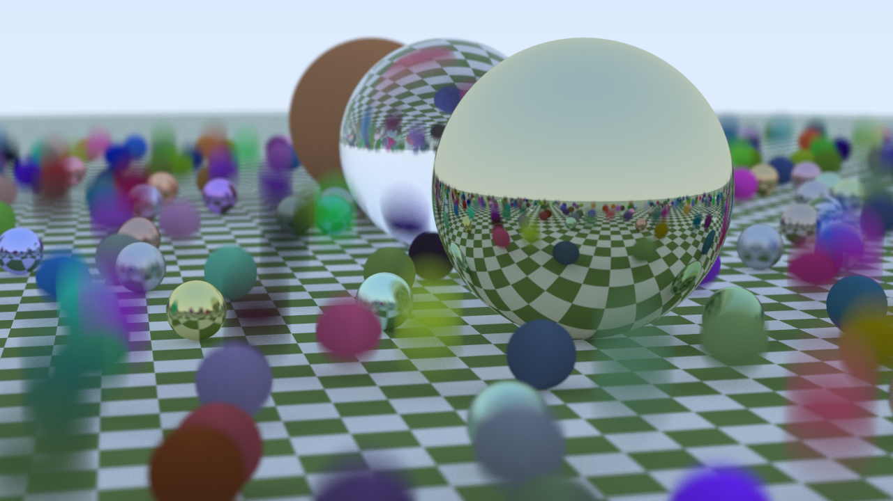

# raytracing-rust

Rust implementation of the path tracer described by Peter Shirley in his book series "Ray Tracing in One Weekend".

This project is still under development as my first atempt to learn Rust. 
Here, I'll try not only to "translate" from the C++ code in the books, but also put some of my own ideas into it.

### Roadmap

- [x] First book ("Ray Tracing in One Weekend") implementation;
- [x] Multi-threading implementation;
- [ ] Triangle Mesh Hittable implementation;
- [ ] Second book ("Ray Tracing: The Next Week") implementation;
- [ ] Third book ("Ray Tracing: The Rest of Your Life") implementation;